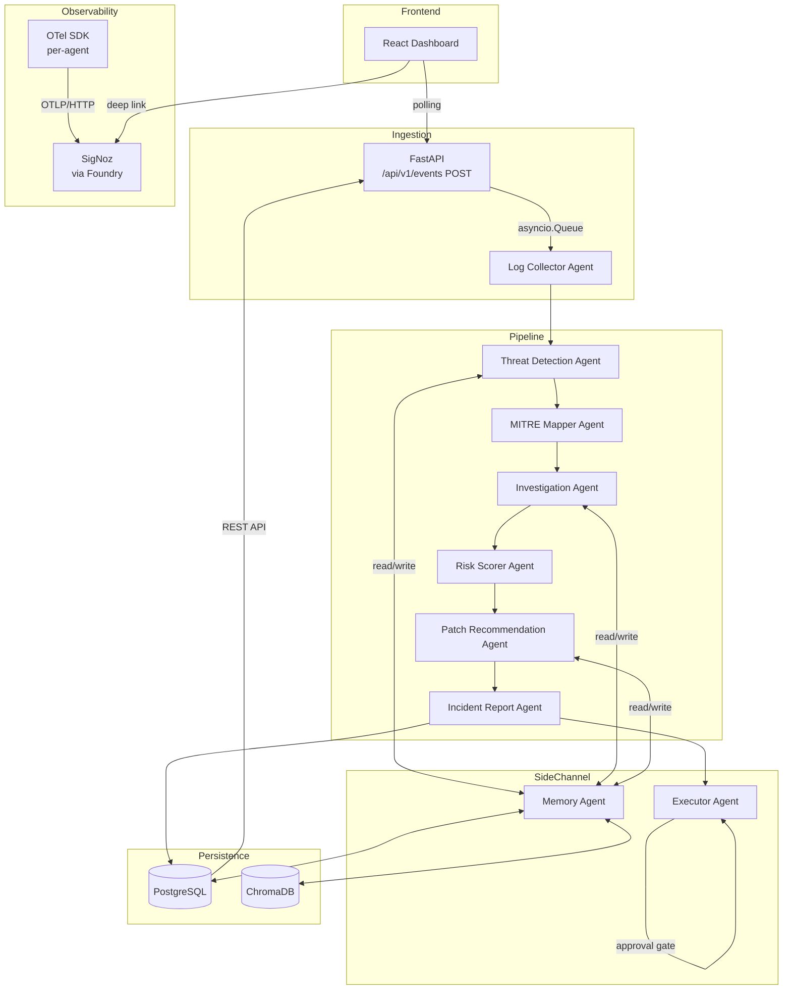

# Design Document: CortexSOC

## Overview

CortexSOC is an AI-powered Security Operations Center (SOC) built for the SigNoz AI Observability Hackathon. It is a nine-agent multi-agent system where autonomous AI agents collaborate in a sequential pipeline to detect, investigate, score, and respond to security threats. Every agent decision is fully traceable through OpenTelemetry instrumentation piped into a self-hosted SigNoz instance deployed via Foundry.

### Design Goals

1. **Full observability by default** — every LLM call, tool invocation, and agent state transition emits an OTel span, metric, or log.
2. **Hackathon reproducibility** — a single `foundry cast` command deploys SigNoz; `docker compose up` starts all CortexSOC services.
3. **40-hour MVP** — the design constrains scope to what a solo developer can ship before July 22, 2026, deferring non-essential features to stretch.
4. **Explainability** — every agent output carries a `confidence_score` and structured reasoning that SigNoz dashboards surface in real time.

### System Summary

```
Raw Events → Log Collector → Threat Detection → MITRE Mapper → Investigation
                                                                      ↓
                             Incident Report ← Patch Recommendation ← Risk Scorer
                                    ↓
                                Frontend Dashboard ← REST API ← PostgreSQL
                                                              ↑
                                                       SigNoz (OTel)
```


---

## Architecture

### Technology Stack and Justifications

| Layer | Technology | Justification | Alternative Considered |
|-------|-----------|---------------|----------------------|
| **Frontend** | React 18 + TypeScript + Vite | Component model maps cleanly to dashboard panels; Vite cold-start <300 ms; TypeScript catches API contract bugs at build time | Next.js — adds SSR complexity not needed for a SPA dashboard |
| **Backend** | Python 3.12 + FastAPI | Async-native matches agent concurrency model; first-class OTel SDK; OpenAPI schema auto-generated; rapid development | Node/Express — weaker OTel Python ecosystem integration |
| **Database** | PostgreSQL 16 | Relational FK constraints between Events/Incidents/Findings; JSONB for flexible payloads; excellent asyncpg driver | SQLite — no concurrent write safety for multi-agent writes |
| **Vector DB** | ChromaDB (embedded) | No separate service for MVP; Python-native; cosine similarity built-in; upgrade path to Chroma server for stretch | Pinecone — managed but requires external API; Weaviate — too heavy for MVP |
| **LLM Layer** | OpenAI API (gpt-4o-mini default, configurable via `LLM_MODEL` env var) | Structured outputs (JSON mode) prevent fragile parsing; gpt-4o-mini cost ~$0.15/1M input tokens; embedding API bundled | Local Ollama — lower cost but higher latency; unreliable on judge hardware |
| **Agent Runtime** | Custom Python orchestrator (`asyncio` + `asyncio.Queue`) | Full control over OTel context propagation between agents; zero external dependencies for MVP | Celery — adds Redis/RabbitMQ dependency; overkill for sequential pipeline |
| **OTel SDK** | `opentelemetry-sdk` + `opentelemetry-exporter-otlp` | Official Python SDK; W3C traceparent propagation; OTLP/HTTP exporter compatible with SigNoz | Datadog agent — not self-hostable; proprietary |
| **Observability** | SigNoz (self-hosted via Foundry) | Hackathon requirement; ClickHouse backend handles high-cardinality traces; dashboard JSON import/export | Grafana + Tempo — multi-service setup increases judge deployment complexity |
| **Container** | Docker + Docker Compose v2 | Universal; judges likely have Docker Desktop; single `docker compose up` constraint from requirements | Podman — less universal on judge machines |
| **Message Queue** | `asyncio.Queue` (in-process, MVP); Redis Streams (stretch) | Zero dependencies for MVP; same interface as Redis Streams for easy upgrade | RabbitMQ — heavyweight; not justified for sequential nine-agent pipeline |
| **Security** | Bearer JWT + FastAPI middleware | Standard; well-understood; `python-jose` library handles signing/validation | OAuth2 — too complex for hackathon; multi-user auth is explicitly out of MVP scope |

### MVP vs Stretch Classification

| Component | MVP | Stretch |
|-----------|-----|---------|
| All 9 agents with functional LLM calls | ✅ | |
| OTel instrumentation on all agents | ✅ | |
| SigNoz receiving traces + metrics | ✅ | |
| REST API (incidents, events, agent status) | ✅ | |
| Frontend incident list + detail views | ✅ | |
| Agent Status panel | ✅ | |
| Executor `block_ip` + `create_ticket` | ✅ | |
| Executor `isolate_host` (real implementation) | | ✅ |
| Redis Streams message queue | | ✅ |
| Multi-user authentication + RBAC | | ✅ |
| Real-time WebSocket updates | | ✅ |
| MITRE ATT&CK live STIX sync | | ✅ |


### System Diagram




---

## Components and Interfaces

### Repository Folder Structure

```
cortex-soc/
├── casting.yaml              # Foundry deployment config for SigNoz (committed)
├── casting.yaml.lock         # Foundry lock file (committed, reproducible)
├── docker-compose.yml        # Starts backend, agents, frontend, PostgreSQL, ChromaDB
├── .env.example              # All required environment variables with defaults
├── README.md                 # Prerequisites, start commands, service URLs
│
├── backend/                  # FastAPI application (Python 3.12)
│   ├── main.py               # FastAPI app factory, middleware registration, lifespan
│   ├── config.py             # Pydantic settings (reads from env vars)
│   ├── database.py           # asyncpg connection pool, Alembic integration
│   ├── otel.py               # OTel SDK initialisation, tracer/meter providers
│   ├── auth.py               # Bearer JWT middleware
│   ├── routers/
│   │   ├── incidents.py      # GET /incidents, GET /incidents/{id}
│   │   ├── events.py         # POST /events
│   │   └── agents.py         # GET /agents/status
│   ├── models/               # SQLAlchemy ORM models (Events, Incidents, Findings…)
│   ├── schemas/              # Pydantic request/response schemas
│   ├── services/             # Business logic (incident_service, event_service…)
│   └── migrations/           # Alembic migration scripts
│
├── agents/                   # All nine agent implementations
│   ├── runtime/
│   │   ├── orchestrator.py   # asyncio.Queue pipeline router, dead-letter logic
│   │   ├── envelope.py       # MessageEnvelope dataclass + serialisation
│   │   └── base_agent.py     # BaseAgent ABC with OTel span lifecycle
│   ├── log_collector/
│   │   ├── agent.py          # Log Collector implementation
│   │   └── parsers.py        # JSON syslog, CEF, Apache/Nginx parsers
│   ├── threat_detection/
│   │   └── agent.py
│   ├── memory/
│   │   ├── agent.py
│   │   └── vector_store.py   # ChromaDB wrapper with fallback logic
│   ├── mitre_mapper/
│   │   ├── agent.py
│   │   └── stix_cache.py     # Local MITRE ATT&CK STIX dataset loader
│   ├── investigation/
│   │   └── agent.py
│   ├── risk_scorer/
│   │   └── agent.py          # Deterministic weighted formula
│   ├── patch_recommendation/
│   │   └── agent.py
│   ├── incident_report/
│   │   └── agent.py          # Markdown + JSON dual-format output
│   └── executor/
│       ├── agent.py
│       └── action_registry.yaml  # Read-only at runtime (OS permissions enforced)
│
├── frontend/                 # React 18 + TypeScript + Vite
│   ├── src/
│   │   ├── App.tsx
│   │   ├── api/              # Typed fetch wrappers for all API endpoints
│   │   ├── components/
│   │   │   ├── IncidentList.tsx
│   │   │   ├── IncidentDetail.tsx
│   │   │   ├── AgentStatus.tsx
│   │   │   └── ConnectionBanner.tsx
│   │   ├── hooks/            # usePolling, useIncidents, useAgentStatus
│   │   └── types/            # TypeScript interfaces mirroring API schemas
│   ├── index.html
│   └── vite.config.ts
│
├── dashboards/               # SigNoz dashboard JSON exports (importable)
│   ├── agent_health_overview.json
│   ├── incident_pipeline_throughput.json
│   ├── llm_cost_and_latency.json
│   └── threat_detection_rate.json
│
├── scripts/
│   ├── seed_events.py        # Generates synthetic security events for demo
│   └── health_check.sh       # Polls all service health endpoints
│
└── tests/
    ├── unit/                 # pytest unit tests (per-agent, per-service)
    ├── integration/          # pytest-asyncio integration tests (API + DB)
    └── property/             # Hypothesis property-based tests
```


### Agent Communication Protocol

#### Message Envelope

Every inter-agent message uses the `MessageEnvelope` schema:

```json
{
  "$schema": "https://json-schema.org/draft/2020-12/schema",
  "title": "MessageEnvelope",
  "type": "object",
  "required": ["message_id", "source_agent", "target_agent", "payload_schema_version",
               "payload", "correlation_id", "traceparent", "created_at"],
  "properties": {
    "message_id":            { "type": "string", "format": "uuid" },
    "correlation_id":        { "type": "string", "format": "uuid",
                               "description": "Unchanged across all spans in one trace" },
    "traceparent":           { "type": "string",
                               "description": "W3C traceparent header value for OTel context propagation" },
    "source_agent":          { "type": "string", "enum": [
                               "log_collector","threat_detection","mitre_mapper",
                               "investigation","risk_scorer","patch_recommendation",
                               "incident_report","executor","memory"] },
    "target_agent":          { "type": "string" },
    "payload_schema_version":{ "type": "string", "pattern": "^\\d+\\.\\d+\\.\\d+$" },
    "payload":               { "type": "object",
                               "description": "Agent-specific structured output" },
    "confidence_score":      { "type": "number", "minimum": 0.0, "maximum": 1.0 },
    "created_at":            { "type": "string", "format": "date-time" },
    "error":                 { "type": ["string", "null"],
                               "description": "Set when the source agent encountered an error" }
  }
}
```

#### Pipeline Routing

```
asyncio.Queue (main pipeline):
  log_collector → threat_detection → mitre_mapper → investigation
                                                          → risk_scorer
                                                          → patch_recommendation
                                                          → incident_report

asyncio.Queue (dead-letter):
  receives envelopes when: routing fails, agent raises unhandled exception,
  confidence_score < 0.5, or Executor action is rejected

asyncio.Queue (human-review):
  receives envelopes when: confidence_score < 0.5, LLM retries exhausted,
  Executor requires approval for HIGH/CRITICAL impact
```

#### Memory Agent Invocation Pattern

```python
# Before LLM call (read)
try:
    context = await memory_agent.read(query=event_text, k=5, min_similarity=0.75)
except MemoryReadError as e:
    span.add_event("memory_read_failure", {"error": str(e)})
    context = []  # proceed without context

# After agent output (write) — non-blocking
try:
    await memory_agent.write(finding_id=output.id, content=output.dict())
except MemoryWriteError as e:
    span.add_event("memory_write_failure", {"error": str(e)})
    # output is NOT discarded
```


### REST API — OpenAPI 3.0 Specification

```yaml
openapi: "3.0.3"
info:
  title: CortexSOC API
  version: "1.0.0"
servers:
  - url: http://localhost:8000/api/v1

paths:
  /events:
    post:
      summary: Ingest a raw security event
      security:
        - bearerAuth: []
      requestBody:
        required: true
        content:
          application/json:
            schema:
              type: object
              required: [source, raw_payload]
              properties:
                source:       { type: string, maxLength: 256 }
                raw_payload:  { type: string, maxLength: 10000 }
      responses:
        "202":
          description: Accepted
          content:
            application/json:
              schema:
                type: object
                properties:
                  event_id: { type: string, format: uuid }
        "400": { $ref: "#/components/responses/BadRequest" }
        "401": { $ref: "#/components/responses/Unauthorized" }
        "422": { $ref: "#/components/responses/UnprocessableEntity" }
        "500": { $ref: "#/components/responses/InternalError" }

  /incidents:
    get:
      summary: List incidents (paginated)
      security:
        - bearerAuth: []
      parameters:
        - name: page
          in: query
          schema: { type: integer, minimum: 1, default: 1 }
        - name: page_size
          in: query
          schema: { type: integer, minimum: 1, maximum: 100, default: 20 }
      responses:
        "200":
          description: Paginated incident list
          content:
            application/json:
              schema:
                type: object
                properties:
                  data:
                    type: array
                    items: { $ref: "#/components/schemas/IncidentSummary" }
                  page:      { type: integer }
                  page_size: { type: integer }
                  total:     { type: integer }
        "401": { $ref: "#/components/responses/Unauthorized" }
        "500": { $ref: "#/components/responses/InternalError" }

  /incidents/{id}:
    get:
      summary: Get full incident detail
      security:
        - bearerAuth: []
      parameters:
        - name: id
          in: path
          required: true
          schema: { type: string, format: uuid }
      responses:
        "200":
          description: Full incident detail
          content:
            application/json:
              schema: { $ref: "#/components/schemas/IncidentDetail" }
        "401": { $ref: "#/components/responses/Unauthorized" }
        "404": { $ref: "#/components/responses/NotFound" }
        "500": { $ref: "#/components/responses/InternalError" }

  /agents/status:
    get:
      summary: Get status of all nine agents
      security:
        - bearerAuth: []
      responses:
        "200":
          description: Agent status map
          content:
            application/json:
              schema:
                type: object
                additionalProperties:
                  $ref: "#/components/schemas/AgentStatus"
        "401": { $ref: "#/components/responses/Unauthorized" }

  /health:
    get:
      summary: Health check (unauthenticated)
      responses:
        "200":
          content:
            application/json:
              schema:
                type: object
                properties:
                  status: { type: string, enum: [ok] }
                  version: { type: string }

components:
  securitySchemes:
    bearerAuth:
      type: http
      scheme: bearer
      bearerFormat: JWT

  schemas:
    IncidentSummary:
      type: object
      properties:
        id:            { type: string, format: uuid }
        status:        { type: string, enum: [open, investigating, resolved, false_positive] }
        risk_score:    { type: number, minimum: 0, maximum: 100 }
        mitre_tactics: { type: array, items: { type: string } }
        created_at:    { type: string, format: date-time }

    IncidentDetail:
      allOf:
        - $ref: "#/components/schemas/IncidentSummary"
        - type: object
          properties:
            finding:                { $ref: "#/components/schemas/Finding" }
            risk_score_breakdown:   { $ref: "#/components/schemas/RiskScoreBreakdown" }
            patch_recommendation:   { $ref: "#/components/schemas/PatchRecommendation" }
            incident_report:        { $ref: "#/components/schemas/IncidentReport" }

    Finding:
      type: object
      properties:
        id:               { type: string, format: uuid }
        event_ids:        { type: array, items: { type: string, format: uuid } }
        threat_type:      { type: string }
        mitre_tactics:    { type: array, items: { type: string } }
        attack_narrative: { type: ["string", "null"] }
        affected_assets:  { type: array, items: { type: string } }
        confidence_score: { type: number, minimum: 0.0, maximum: 1.0 }

    RiskScoreBreakdown:
      type: object
      properties:
        score:           { type: number, minimum: 0, maximum: 100 }
        mitre_weight:    { type: number }
        confidence_pts:  { type: number }
        asset_pts:       { type: number }
        recurrence_pts:  { type: number }
        scoring_version: { type: string }
        computed_at:     { type: string, format: date-time }

    PatchRecommendation:
      type: object
      properties:
        finding_id:        { type: string, format: uuid }
        steps:             { type: array, items: { type: string } }
        estimated_effort:  { type: string, enum: [low, medium, high], nullable: true }
        confidence_score:  { type: number, minimum: 0.0, maximum: 1.0 }

    IncidentReport:
      type: object
      properties:
        incident_id:         { type: string, format: uuid }
        executive_summary:   { type: string }
        technical_details:   { type: string }
        timeline:            { type: array, items: { type: object } }
        affected_assets:     { type: array, items: { type: string } }
        mitre_mapping:       { type: object }
        risk_score_breakdown:{ type: object }
        remediation_steps:   { type: array, items: { type: string } }
        report_generated_at: { type: string, format: date-time }
        markdown:            { type: string }

    AgentStatus:
      type: object
      properties:
        name:              { type: string }
        status:            { type: string, enum: [idle, running, error] }
        last_run_at:       { type: ["string", "null"], format: date-time }
        last_error:        { type: ["string", "null"] }
        invocation_count:  { type: integer }
        error_count:       { type: integer }
        avg_confidence:    { type: ["number", "null"] }

  responses:
    BadRequest:
      description: Input validation failed
      content:
        application/json:
          schema:
            type: object
            properties:
              detail: { type: string }
              field:  { type: string }
    Unauthorized:
      description: Missing or invalid Bearer token
      content:
        application/json:
          schema:
            type: object
            properties:
              detail: { type: string }
    NotFound:
      description: Resource not found
      content:
        application/json:
          schema:
            type: object
            properties:
              detail: { type: string }
    UnprocessableEntity:
      description: Schema validation failed
      content:
        application/json:
          schema:
            type: object
            properties:
              detail:
                type: array
                items:
                  type: object
                  properties:
                    loc:  { type: array }
                    msg:  { type: string }
                    type: { type: string }
    InternalError:
      description: Internal server error
      content:
        application/json:
          schema:
            type: object
            properties:
              detail: { type: string }
```


---

## Data Models

### Full PostgreSQL DDL

```sql
-- ─────────────────────────────────────────────
-- CortexSOC Database Schema v1.0.0
-- PostgreSQL 16
-- ─────────────────────────────────────────────

CREATE EXTENSION IF NOT EXISTS "pgcrypto";

-- ── Events ──────────────────────────────────
CREATE TABLE events (
    id                  UUID PRIMARY KEY DEFAULT gen_random_uuid(),
    source              VARCHAR(256)  NOT NULL,
    raw_payload         TEXT          NOT NULL,
    normalised_payload  JSONB,
    received_at         TIMESTAMPTZ   NOT NULL DEFAULT NOW(),
    processed_at        TIMESTAMPTZ
);

CREATE INDEX idx_events_source      ON events (source);
CREATE INDEX idx_events_received_at ON events (received_at DESC);

-- ── Findings ────────────────────────────────
CREATE TABLE findings (
    id               UUID PRIMARY KEY DEFAULT gen_random_uuid(),
    event_ids        UUID[]        NOT NULL,
    threat_type      VARCHAR(256),
    mitre_tactics    TEXT[],
    attack_narrative TEXT,
    affected_assets  TEXT[],
    confidence_score NUMERIC(4,3)  NOT NULL CHECK (confidence_score BETWEEN 0.0 AND 1.0),
    created_at       TIMESTAMPTZ   NOT NULL DEFAULT NOW()
);

-- event_ids FK check enforced at application layer (array FK not native in PG)

-- ── Incidents ───────────────────────────────
CREATE TYPE incident_status AS ENUM ('open', 'investigating', 'resolved', 'false_positive');

CREATE TABLE incidents (
    id           UUID PRIMARY KEY DEFAULT gen_random_uuid(),
    finding_id   UUID          NOT NULL REFERENCES findings(id) ON DELETE RESTRICT,
    risk_score   NUMERIC(5,2)  NOT NULL CHECK (risk_score BETWEEN 0.0 AND 100.0),
    mitre_tactics TEXT[]       NOT NULL DEFAULT '{}',
    status       incident_status NOT NULL DEFAULT 'open',
    created_at   TIMESTAMPTZ   NOT NULL DEFAULT NOW(),
    updated_at   TIMESTAMPTZ   NOT NULL DEFAULT NOW()
);

CREATE INDEX idx_incidents_status     ON incidents (status);
CREATE INDEX idx_incidents_created_at ON incidents (created_at DESC);
CREATE INDEX idx_incidents_risk_score ON incidents (risk_score DESC);

-- ── Risk Scores ──────────────────────────────
CREATE TABLE risk_scores (
    id               UUID PRIMARY KEY DEFAULT gen_random_uuid(),
    finding_id       UUID          NOT NULL UNIQUE REFERENCES findings(id) ON DELETE CASCADE,
    score            NUMERIC(5,2)  NOT NULL CHECK (score BETWEEN 0.0 AND 100.0),
    score_breakdown  JSONB         NOT NULL,
    scoring_version  VARCHAR(32)   NOT NULL,
    computed_at      TIMESTAMPTZ   NOT NULL DEFAULT NOW()
);

-- ── Agent Runs ───────────────────────────────
CREATE TABLE agent_runs (
    id               UUID PRIMARY KEY DEFAULT gen_random_uuid(),
    incident_id      UUID          REFERENCES incidents(id) ON DELETE SET NULL,
    agent_name       VARCHAR(64)   NOT NULL,
    correlation_id   UUID          NOT NULL,
    status           VARCHAR(32)   NOT NULL,  -- success | failure | retry_exhausted
    started_at       TIMESTAMPTZ   NOT NULL DEFAULT NOW(),
    finished_at      TIMESTAMPTZ,
    error_message    TEXT,
    span_id          VARCHAR(32)
);

CREATE INDEX idx_agent_runs_incident_id ON agent_runs (incident_id);
CREATE INDEX idx_agent_runs_agent_name  ON agent_runs (agent_name);

-- ── Patches ──────────────────────────────────
CREATE TABLE patches (
    id               UUID PRIMARY KEY DEFAULT gen_random_uuid(),
    finding_id       UUID          NOT NULL UNIQUE REFERENCES findings(id) ON DELETE CASCADE,
    steps            JSONB         NOT NULL,  -- ordered array of strings
    estimated_effort VARCHAR(16),            -- low | medium | high | null
    confidence_score NUMERIC(4,3)  NOT NULL CHECK (confidence_score BETWEEN 0.0 AND 1.0),
    created_at       TIMESTAMPTZ   NOT NULL DEFAULT NOW()
);

-- ── Incident Reports ─────────────────────────
CREATE TABLE incident_reports (
    id                   UUID PRIMARY KEY DEFAULT gen_random_uuid(),
    incident_id          UUID          NOT NULL UNIQUE REFERENCES incidents(id) ON DELETE CASCADE,
    executive_summary    TEXT          NOT NULL,
    technical_details    TEXT          NOT NULL,
    timeline             JSONB         NOT NULL,
    affected_assets      TEXT[]        NOT NULL DEFAULT '{}',
    mitre_mapping        JSONB         NOT NULL,
    risk_score_breakdown JSONB         NOT NULL,
    remediation_steps    JSONB         NOT NULL,
    report_markdown      TEXT          NOT NULL,
    report_json          JSONB         NOT NULL,
    report_generated_at  TIMESTAMPTZ   NOT NULL DEFAULT NOW()
);

-- ── Updated_at trigger (incidents) ───────────
CREATE OR REPLACE FUNCTION set_updated_at()
RETURNS TRIGGER AS $$
BEGIN
    NEW.updated_at = NOW();
    RETURN NEW;
END;
$$ LANGUAGE plpgsql;

CREATE TRIGGER incidents_updated_at
    BEFORE UPDATE ON incidents
    FOR EACH ROW EXECUTE FUNCTION set_updated_at();
```

### Entity Relationship Summary

```
events (1) ──< findings.event_ids (many, array)
findings (1) ──── incidents (1)      via incidents.finding_id
findings (1) ──── risk_scores (1)    via risk_scores.finding_id
findings (1) ──── patches (1)        via patches.finding_id
incidents (1) ──< agent_runs (many)  via agent_runs.incident_id
incidents (1) ──── incident_reports  via incident_reports.incident_id
```


---

## OTel Instrumentation Plan

### SDK Initialization (per agent)

Each agent calls `init_telemetry()` at startup:

```python
# agents/runtime/otel_setup.py
from opentelemetry import trace, metrics
from opentelemetry.sdk.trace import TracerProvider
from opentelemetry.sdk.trace.export.in_memory_span_exporter import InMemorySpanExporter
from opentelemetry.sdk.metrics import MeterProvider
from opentelemetry.exporter.otlp.proto.http.trace_exporter import OTLPSpanExporter
from opentelemetry.exporter.otlp.proto.http.metric_exporter import OTLPMetricExporter
from opentelemetry.sdk.trace.export import BatchSpanProcessor
from opentelemetry.sdk.metrics.export import PeriodicExportingMetricReader
from opentelemetry.sdk.resources import Resource

def init_telemetry(service_name: str) -> tuple[trace.Tracer, metrics.Meter]:
    resource = Resource({"service.name": service_name,
                         "service.version": "1.0.0",
                         "deployment.environment": os.getenv("ENV", "development")})

    otlp_endpoint = os.getenv("OTLP_ENDPOINT", "http://localhost:4318")
    flush_interval = int(os.getenv("OTLP_FLUSH_INTERVAL_MS", "1000"))  # 1s dev, 5000 prod
    batch_size     = int(os.getenv("OTLP_BATCH_SIZE", "512"))

    tracer_provider = TracerProvider(resource=resource)
    tracer_provider.add_span_processor(
        BatchSpanProcessor(
            OTLPSpanExporter(endpoint=f"{otlp_endpoint}/v1/traces"),
            max_export_batch_size=batch_size,
            schedule_delay_millis=flush_interval,
        )
    )
    trace.set_tracer_provider(tracer_provider)

    metric_reader = PeriodicExportingMetricReader(
        OTLPMetricExporter(endpoint=f"{otlp_endpoint}/v1/metrics"),
        export_interval_millis=flush_interval,
    )
    meter_provider = MeterProvider(resource=resource, metric_readers=[metric_reader])
    metrics.set_meter_provider(meter_provider)

    return (trace.get_tracer(service_name),
            metrics.get_meter(service_name))
```

### Standard Span Attributes (all agents)

| Attribute | Type | Description |
|-----------|------|-------------|
| `agent.name` | string | e.g. `cortexsoc.threat_detection` |
| `agent.version` | string | semver |
| `llm.model` | string | e.g. `gpt-4o-mini` |
| `llm.prompt_tokens` | int | tokens sent |
| `llm.completion_tokens` | int | tokens received |
| `agent.confidence_score` | float | 0.0–1.0 |
| `agent.tool_calls_count` | int | number of tool invocations |
| `agent.retry_count` | int | LLM retries this invocation |

### Tool Call Child Spans

```python
with tracer.start_as_current_span("tool_call") as span:
    span.set_attribute("tool.name", tool_name)
    span.set_attribute("tool.input_size_bytes", len(input_str.encode()))
    result = await tool.execute(input)
    span.set_attribute("tool.output_size_bytes", len(str(result).encode()))
    span.set_attribute("tool.latency_ms", elapsed_ms)
```

### Metrics Definitions

```python
# cortexsoc.agent.invocations_total — Counter
invocations_counter = meter.create_counter(
    "cortexsoc.agent.invocations_total",
    description="Total agent invocations",
    unit="1",
)
# Labels: agent_name, outcome (success|failure|retry)

# cortexsoc.agent.latency_ms — Histogram
latency_histogram = meter.create_histogram(
    "cortexsoc.agent.latency_ms",
    description="Agent processing latency",
    unit="ms",
)
# Labels: agent_name

# cortexsoc.agent.confidence_score — Gauge (ObservableGauge)
# Recorded after each invocation via callback
confidence_gauge = meter.create_observable_gauge(
    "cortexsoc.agent.confidence_score",
    callbacks=[lambda: [(last_confidence, {"agent_name": name})]],
    description="Last observed agent confidence score",
    unit="1",
)

# cortexsoc.risk.high_risk_findings — Counter (Risk Scorer only)
high_risk_counter = meter.create_counter(
    "cortexsoc.risk.high_risk_findings",
    description="Findings with risk score > 80",
    unit="1",
)
# Labels: finding_id
```

### OTLP Environment Variables

| Variable | Default (dev) | Default (prod) | Description |
|----------|--------------|----------------|-------------|
| `OTLP_ENDPOINT` | `http://signoz:4318` | `http://signoz:4318` | OTLP HTTP endpoint |
| `OTLP_FLUSH_INTERVAL_MS` | `1000` | `5000` | Flush interval |
| `OTLP_BATCH_SIZE` | `512` | `512` | Max spans per batch |
| `ENV` | `development` | `production` | Sets resource attribute |

### Agent-Specific Span Attributes

| Agent | Additional Attributes |
|-------|-----------------------|
| Log Collector | `event.source_format`, `event.size_bytes`, `event.normalised` (bool) |
| Threat Detection | (standard only) |
| MITRE Mapper | `mitre.tactic_id`, `mitre.technique_id`, `mitre.confidence_score` |
| Investigation | `investigation.events_correlated_count`, `investigation.confidence_score`, `investigation.affected_assets_count` |
| Risk Scorer | `risk.score`, `risk.scoring_version`, `risk.factors_count` |
| Patch Recommendation | `patch.steps_count`, `patch.estimated_effort`, `patch.confidence_score` |
| Incident Report | `report.format`, `report.word_count`, `report.generation_latency_ms` |
| Executor | `executor.action_type`, `executor.target`, `executor.impact_level`, `executor.result` |
| Memory | `memory.operation` (read/write), `memory.store` (relational/vector), `memory.records_returned` |


---

## SigNoz Dashboard Plan

All four dashboard JSON files live in `dashboards/` and are importable via SigNoz UI → New Dashboard → Import JSON.

### Dashboard 1: Agent Health Overview (`agent_health_overview.json`)

**Panels:**
1. **Invocation Rate** — Time series, `cortexsoc.agent.invocations_total` rate per agent, 60-min rolling window
2. **Error Rate** — Time series, `cortexsoc.agent.invocations_total` filtered `outcome=failure` rate per agent
3. **Latency p50/p95/p99** — Time series, `cortexsoc.agent.latency_ms` percentiles per agent
4. **Average Confidence Score** — Gauge/single-stat, `cortexsoc.agent.confidence_score` last value per agent

```json
{
  "id": "cortexsoc-agent-health",
  "title": "Agent Health Overview",
  "description": "Per-agent invocation rate, error rate, latency percentiles, and confidence scores",
  "tags": ["cortexsoc", "agents"],
  "layout": [],
  "panels": [
    {
      "id": "panel-invocation-rate",
      "title": "Invocation Rate (per min)",
      "type": "graph",
      "query": {
        "queryType": "metrics",
        "promql": "rate(cortexsoc_agent_invocations_total[1m])",
        "legend": "{{agent_name}}"
      },
      "timeRange": { "last": "1h" }
    },
    {
      "id": "panel-error-rate",
      "title": "Error Rate (per min)",
      "type": "graph",
      "query": {
        "queryType": "metrics",
        "promql": "rate(cortexsoc_agent_invocations_total{outcome=\"failure\"}[1m])",
        "legend": "{{agent_name}}"
      }
    },
    {
      "id": "panel-latency-p95",
      "title": "Latency p50/p95/p99 (ms)",
      "type": "graph",
      "query": {
        "queryType": "metrics",
        "promql": "histogram_quantile(0.95, rate(cortexsoc_agent_latency_ms_bucket[5m]))",
        "legend": "p95 {{agent_name}}"
      }
    },
    {
      "id": "panel-confidence",
      "title": "Average Confidence Score",
      "type": "value",
      "query": {
        "queryType": "metrics",
        "promql": "cortexsoc_agent_confidence_score",
        "legend": "{{agent_name}}"
      }
    }
  ]
}
```

### Dashboard 2: Incident Pipeline Throughput (`incident_pipeline_throughput.json`)

**Panels:**
1. **Events Ingested/min** — `cortexsoc.agent.invocations_total{agent_name="cortexsoc.log_collector"}` rate
2. **Incidents Created/hr** — events matching `incident_report` agent success, rate per hour
3. **Mean End-to-End Latency (ms)** — trace duration from root log_collector span to incident_report span
4. **Pipeline Drop-off by Stage** — bar chart, count of envelopes per stage vs prior stage

### Dashboard 3: LLM Cost and Latency (`llm_cost_and_latency.json`)

**Panels:**
1. **Prompt Tokens/hr per Agent** — `sum by (agent_name) (increase(cortexsoc_llm_prompt_tokens_total[1h]))`
2. **Completion Tokens/hr per Agent** — same for completion tokens
3. **p95 LLM Call Latency (ms)** — histogram_quantile on `cortexsoc_agent_latency_ms` filtered to LLM tool spans

### Dashboard 4: Threat Detection Rate (`threat_detection_rate.json`)

**Panels:**
1. **Threat Signals/hr** — `cortexsoc.agent.invocations_total{agent_name="cortexsoc.threat_detection", outcome="success"}` hourly rate
2. **MITRE Tactic Distribution** — bar chart on `mitre.tactic_id` span attribute aggregated from traces
3. **Risk Score Distribution** — histogram with buckets [0-20, 21-40, 41-60, 61-80, 81-100]


---

## Per-Agent Detailed Design

### Base Agent Pattern

All agents extend `BaseAgent`:

```python
class BaseAgent(ABC):
    def __init__(self, name: str, tracer: Tracer, meter: Meter):
        self.name = name
        self.tracer = tracer
        self.meter = meter
        self.invocations_counter = meter.create_counter("cortexsoc.agent.invocations_total")
        self.latency_histogram   = meter.create_histogram("cortexsoc.agent.latency_ms")

    async def process(self, envelope: MessageEnvelope) -> MessageEnvelope:
        ctx = extract(carrier={"traceparent": envelope.traceparent})
        with self.tracer.start_as_current_span(
            f"{self.name}.process", context=ctx,
            kind=SpanKind.INTERNAL
        ) as span:
            span.set_attribute("agent.name", self.name)
            t0 = time.monotonic()
            try:
                result = await self._process(envelope, span)
                self.invocations_counter.add(1, {"agent_name": self.name, "outcome": "success"})
                return result
            except Exception as e:
                span.record_exception(e)
                span.set_status(StatusCode.ERROR)
                self.invocations_counter.add(1, {"agent_name": self.name, "outcome": "failure"})
                raise
            finally:
                self.latency_histogram.record(
                    (time.monotonic() - t0) * 1000, {"agent_name": self.name}
                )

    @abstractmethod
    async def _process(self, envelope: MessageEnvelope, span: Span) -> MessageEnvelope:
        ...
```

---

### Agent 1: Log Collector

**Input:** Raw event (source + raw_payload string)
**Output:** Normalised event (MessageEnvelope with structured event payload)
**Tools:** Format parsers (JSON syslog, CEF, Apache/Nginx)

**LLM prompt template** (used only for ambiguous payloads as fallback):
```
You are a log normalisation assistant.
Given the following raw log line, extract: timestamp, source_ip, destination_ip,
event_type, severity, and any other fields present.
Return a JSON object with exactly these keys. Use null for missing fields.

Raw log:
{raw_payload}
```

**Memory usage:** None (stateless normalisation)

**Failure handling:**
- Parse failure → WARN log + dead-letter store + `parse_failure` span event
- Runtime unavailable → local retry queue, 3x exponential backoff (1s, 2s, 4s), then dead-letter

**Telemetry:** `event.source_format`, `event.size_bytes`, `event.normalised`

---

### Agent 2: Threat Detection Agent

**Input:** Normalised event
**Output:** `{is_threat, threat_type, threat_description, confidence_score}`

**LLM prompt template:**
```
You are a security threat detection system.
Analyse the following normalised security event and determine if it represents a threat.

Event:
{event_json}

Past similar incidents (memory context):
{memory_context}

Return JSON with exactly these fields:
- is_threat: boolean
- threat_type: string (e.g. "brute_force", "port_scan", "sql_injection", or null)
- threat_description: string (one sentence)
- confidence_score: float 0.0–1.0

If confidence_score < 0.5, set is_threat to false and explain uncertainty in threat_description.
```

**Memory usage:** Read — up to 5 records, cosine similarity ≥ 0.75
**Failure handling:** LLM transient error → 3x retry (1s, 2s, 4s capped 32s) → human review queue
**Low confidence (<0.5):** Set `is_threat=false`, add `low_confidence` flag, route to human review

---

### Agent 3: Memory Agent

**Input:** Read request `{query, k, min_similarity}` or Write request `{finding_id, content}`
**Output:** `{records: [...]}` for reads; `{ok: true}` for writes

**Tools:** ChromaDB (vector store), asyncpg (relational store)

**Read flow:**
1. Generate query embedding via OpenAI embeddings API
2. Query ChromaDB with cosine similarity, return top-K (≥ min_similarity threshold)
3. Fallback: if ChromaDB unavailable → PostgreSQL full-text search with `to_tsvector`

**Write flow:**
1. Upsert structured record to PostgreSQL `agent_runs`-adjacent memory table
2. Generate embedding → upsert to ChromaDB with `finding_id` as key
3. If embedding fails → relational store only + `embedding_failure` span event

**Failure handling:** ChromaDB down → `vector_db_fallback` span event, continue with relational
**Telemetry:** `memory.operation`, `memory.store`, `memory.records_returned`

---

### Agent 4: MITRE Mapper Agent

**Input:** Threat signal `{is_threat, threat_type, threat_description, confidence_score}`
**Output:** `{tactic_id, tactic_name, technique_id, technique_name, confidence_score}`
**Tools:** Local STIX dataset cache (JSON file, loaded at startup)

**LLM prompt template:**
```
You are a MITRE ATT&CK mapping assistant.
Given the following threat description, return the top 3 most likely MITRE ATT&CK mappings
ranked by confidence. Each mapping must include: tactic_id, tactic_name, technique_id,
technique_name, and confidence_score (float 0.0–1.0).

Threat: {threat_description}
Threat type: {threat_type}

Return JSON array of objects, highest confidence first.
```

**Validation:** Each candidate technique_id checked against `stix_cache.technique_ids` set.
Invalid IDs are discarded with WARNING span event. If all invalid → error response, no mapping emitted.

**Telemetry:** `mitre.tactic_id`, `mitre.technique_id`, `mitre.confidence_score`

---

### Agent 5: Investigation Agent

**Input:** MITRE-mapped threat signal
**Output:** Finding `{id, event_ids, threat_type, mitre_tactics, attack_narrative, affected_assets, confidence_score}`

**LLM prompt template:**
```
You are a security investigation analyst.
Correlate the following threat signal with historical findings and write an attack narrative.

Current signal:
{signal_json}

Related past findings (memory context):
{memory_context}

Return JSON with:
- threat_type: string
- mitre_tactics: array of strings
- attack_narrative: string (2-3 sentences describing the attack chain)
- affected_assets: array of strings
- confidence_score: float 0.0–1.0

If no historical correlation found, set confidence_score to 0.5 and note this is a standalone finding.
```

**Memory usage:** Read — related findings by MITRE technique_id
**Failure handling:** LLM failure after 3 retries → `attack_narrative=null`, `llm_failure` span event
**No correlation:** Creates standalone Finding with `confidence_score=0.5`
**Telemetry:** `investigation.events_correlated_count`, `investigation.confidence_score`, `investigation.affected_assets_count`

---

### Agent 6: Risk Scorer Agent

**Input:** Finding (with MITRE technique_id and confidence_score)
**Output:** `{score, score_breakdown, scoring_version, computed_at}`

**Deterministic scoring formula:**

```python
MITRE_TECHNIQUE_SEVERITY = {
    # Loaded from mitre_severity_weights.json at startup
    # T1110 (Brute Force): 25, T1059 (Command Exec): 38, etc.
    # Default for unknown: 15
}

def compute_risk_score(finding, mitre_weights, recurrence_count) -> RiskScore:
    mitre_pts      = MITRE_TECHNIQUE_SEVERITY.get(finding.technique_id, 15)  # 0-40
    confidence_pts = round(finding.confidence_score * 30)                     # 0-30
    asset_pts      = min(len(finding.affected_assets) * 5, 20)               # 0-20
    recurrence_pts = min(recurrence_count * 2, 10)                           # 0-10

    score = mitre_pts + confidence_pts + asset_pts + recurrence_pts          # 0-100
    return RiskScore(
        score=score,
        score_breakdown={
            "mitre_weight": mitre_pts, "confidence_pts": confidence_pts,
            "asset_pts": asset_pts, "recurrence_pts": recurrence_pts,
        },
        scoring_version="1.0.0",
        computed_at=datetime.utcnow().isoformat(),
    )
```

**Telemetry:** `risk.score`, `risk.scoring_version`, `risk.factors_count`
**High risk:** score > 80 → increment `cortexsoc.risk.high_risk_findings` counter

---

### Agent 7: Patch Recommendation Agent

**Input:** Risk-scored Finding
**Output:** `{finding_id, steps, estimated_effort, confidence_score}`

**LLM prompt template:**
```
You are a security remediation expert.
Given the following finding and MITRE technique, provide prioritised remediation steps.

Finding: {finding_json}
MITRE Technique: {technique_id} — {technique_name}
Risk Score: {risk_score}

Previously applied patches for this technique (memory context):
{patch_history}

Return JSON with:
- steps: ordered array of strings (highest priority first, max 10 steps)
- estimated_effort: "low" | "medium" | "high"
- confidence_score: float 0.0–1.0

If confidence_score < 0.6, you MUST include this exact string at the end of steps:
"Low-confidence recommendation — manual review advised before applying."
```

**Memory usage:** Read — up to 10 past patches for same `technique_id`
**Failure handling:** LLM failure → empty steps, null effort, confidence=0.0, `llm_failure` span event
**Memory unavailable:** Proceed without history + `memory_unavailable` span event
**Telemetry:** `patch.steps_count`, `patch.estimated_effort`, `patch.confidence_score`

---

### Agent 8: Incident Report Agent

**Input:** Complete pipeline output (Finding + RiskScore + PatchRecommendation)
**Output:** `{markdown: str, json: dict}` persisted to `incident_reports` table

**LLM prompt template:**
```
You are a SOC incident report writer.
Generate a structured incident report from the following pipeline outputs.

Finding: {finding_json}
Risk Score: {risk_score_json}
Patch Recommendation: {patch_json}

Return JSON with exactly these fields:
- executive_summary: string (2-3 sentences for management)
- technical_details: string (detailed technical analysis)
- timeline: array of {timestamp, event} objects
- affected_assets: array of strings
- mitre_mapping: {tactic_id, tactic_name, technique_id, technique_name}
- risk_score_breakdown: object (from risk scorer output)
- remediation_steps: array of strings

Also generate a Markdown version of the report.
```

**Dual format:** JSON (structured storage) + Markdown (human-readable browser rendering)
**SLA:** Generation latency must not exceed 5000 ms (enforced via `asyncio.wait_for`)
**Persistence:** Written to `incident_reports` table; overwrite on duplicate `incident_id` + `report_overwritten` span event
**DB failure:** `db_persist_failure` span event with `incident_id` + error indication
**Telemetry:** `report.format`, `report.word_count`, `report.generation_latency_ms`

---

### Agent 9: Executor Agent

**Input:** Approved response action `{action_type, target, impact_level, approver_id?}`
**Output:** `{action_type, target, executed_at, result, output}`

**Action Registry** (`executor/action_registry.yaml`, read-only at runtime):
```yaml
actions:
  block_ip:
    impact_level: MEDIUM
    description: Adds IP to firewall blocklist
    handler: handlers.block_ip
  isolate_host:
    impact_level: HIGH
    description: Isolates host from network (MVP stub)
    handler: handlers.isolate_host_stub
  create_ticket:
    impact_level: LOW
    description: Creates ticket in ticketing system
    handler: handlers.create_ticket
```

**Approval logic:**
- `LOW`/`MEDIUM` → execute immediately, no gate
- `HIGH`/`CRITICAL` → require signed approval event `{approver_id, timestamp, signature}`; absent approval → reject + `action_rejected` span event

**Failure handling:** Execute → failure → retry once after 5s → if second failure → escalation to human review queue with `{action_id, reason, timestamp}`
**Unregistered action:** Reject + `unregistered_action_rejected` span event with `{action_type, target}`
**Telemetry:** `executor.action_type`, `executor.target`, `executor.impact_level`, `executor.result`


---

## Error Handling

### Error Taxonomy

| Scenario | Agent Response | OTel Signal |
|----------|---------------|-------------|
| LLM transient error (5xx, timeout) | Retry 3x exponential backoff (1s→32s) | Span event per retry |
| LLM retry exhausted | Route to human review queue | `llm_retry_exhausted` span event |
| Low confidence score (<0.5) | Set `is_threat=false` or proceed with flag | `low_confidence` flag in payload |
| Memory read failure | Proceed without context | `memory_read_failure` span event |
| Memory write failure | Retain output, do not discard | `memory_write_failure` span event |
| Vector DB unavailable | Fall back to relational search | `vector_db_fallback` span event |
| Embedding API failure | Relational store only | `embedding_failure` span event |
| MITRE invalid technique_id | Discard candidate, try next | WARNING span event |
| MITRE no valid candidates | Return error response | Error envelope |
| Routing failure | Dead-letter queue, preserve original | DLQ entry with error |
| DB persist failure | Span event, error indication | `db_persist_failure` span event |
| API request >1MB | HTTP 400, identify field | Span event |
| Schema validation failure | HTTP 422, field-level errors | - |
| Bearer token invalid | HTTP 401 | - |
| Unhandled exception | Span ERROR status, HTTP 500 | Exception recorded on span |
| Executor action unregistered | Reject + span event | `unregistered_action_rejected` |
| Executor approval missing (HIGH/CRITICAL) | Reject + span event | `action_rejected` |
| OTLP endpoint unavailable | Buffer up to batch_size, retry on next flush | No agent blocking |
| Report generation >5000ms | `asyncio.wait_for` cancels | `generation_timeout` span event |

### Dead-Letter Queue Design

```python
# Dead-letter entries are stored in PostgreSQL dead_letter table (not shown in main schema)
# Schema:
# id, original_message_id, envelope_json, error_reason, created_at, resolved_at (nullable)

# Routing rules:
# - Parse failures from Log Collector
# - Routing failures in Orchestrator
# - All confidence_score < 0.5 envelopes
# - LLM retry exhausted envelopes
# - Rejected Executor actions (HIGH/CRITICAL, no approval)
```

### Retry Strategy

```python
import asyncio

async def retry_with_backoff(coro_factory, max_retries=3, base_delay=1.0, max_delay=32.0):
    for attempt in range(max_retries + 1):
        try:
            return await coro_factory()
        except TransientError as e:
            if attempt == max_retries:
                raise
            delay = min(base_delay * (2 ** attempt), max_delay)
            await asyncio.sleep(delay)
```


---

## Security Layer Design

### Input Validation

FastAPI middleware enforces before routing:

```python
@app.middleware("http")
async def validate_request_size(request: Request, call_next):
    content_length = request.headers.get("content-length", 0)
    if int(content_length) > 1_000_000:  # 1 MB
        return JSONResponse({"detail": "Request body exceeds 1 MB limit"}, status_code=400)
    return await call_next(request)
```

Pydantic field validators enforce `maxLength: 10000` on all string fields. FastAPI returns HTTP 422 with field-level detail on validation failure.

### OTel Sensitive Data Tagging

LLM prompt contents and raw security payloads must not appear as plain-text span attributes:

```python
# CORRECT — truncate and tag sensitive
span.set_attribute("llm.prompt_preview", raw_payload[:64] + "…")
span.set_attribute("llm.prompt.sensitive", True)

# INCORRECT — never do this
# span.set_attribute("llm.prompt_full", raw_payload)
```

### Bearer Authentication

```python
# backend/auth.py
from fastapi.security import HTTPBearer
from jose import jwt, JWTError

security = HTTPBearer(auto_error=False)

async def verify_token(credentials = Depends(security)) -> dict:
    if credentials is None:
        raise HTTPException(401, detail="Missing Bearer token")
    try:
        payload = jwt.decode(credentials.credentials, SECRET_KEY, algorithms=["HS256"])
        return payload
    except JWTError:
        raise HTTPException(401, detail="Invalid or expired token")
```

Health check (`GET /health`) is excluded from Bearer requirement by not applying the dependency.

### Executor Registry File Permissions

The `action_registry.yaml` file must be owned by `root` and readable (not writable) by the agent process:

```dockerfile
# In Dockerfile for executor agent:
COPY action_registry.yaml /app/action_registry.yaml
RUN chmod 444 /app/action_registry.yaml
USER cortexsoc  # non-root user cannot write 444 files
```

### SigNoz Network Binding

In `casting.yaml` and `docker-compose.yml`, SigNoz admin UI binds to `127.0.0.1` only:

```yaml
# docker-compose.yml (SigNoz service)
ports:
  - "127.0.0.1:3301:3301"  # Admin UI — loopback only, NOT 0.0.0.0
  - "127.0.0.1:4317:4317"  # OTLP gRPC
  - "127.0.0.1:4318:4318"  # OTLP HTTP
```


---

## MVP Scope Table

| Feature | Hours | Difficulty | Risk | Status |
|---------|-------|-----------|------|--------|
| PostgreSQL schema + Alembic migrations | 2 | Easy | Low | MVP |
| FastAPI app scaffold + config + health endpoint | 2 | Easy | Low | MVP |
| OTel SDK setup module (shared by all agents) | 2 | Easy | Low | MVP |
| BaseAgent ABC + Orchestrator + asyncio.Queue | 3 | Medium | Medium | MVP |
| Log Collector Agent (parsers + normalisation) | 3 | Medium | Low | MVP |
| MessageEnvelope + W3C traceparent propagation | 2 | Medium | Medium | MVP |
| Memory Agent (ChromaDB + PG relational) | 4 | Medium | Medium | MVP |
| Threat Detection Agent (LLM + memory read) | 3 | Medium | Low | MVP |
| MITRE Mapper Agent (LLM + STIX cache validation) | 3 | Medium | Medium | MVP |
| Investigation Agent (LLM + correlation) | 3 | Medium | Low | MVP |
| Risk Scorer Agent (deterministic formula) | 2 | Easy | Low | MVP |
| Patch Recommendation Agent (LLM + memory) | 3 | Medium | Low | MVP |
| Incident Report Agent (dual-format + DB persist) | 3 | Medium | Low | MVP |
| Executor Agent (action registry + approval gate) | 3 | Medium | Medium | MVP |
| REST API: incidents CRUD + events ingest | 3 | Medium | Low | MVP |
| REST API: agent status endpoint | 1 | Easy | Low | MVP |
| Frontend: incident list + polling | 3 | Medium | Low | MVP |
| Frontend: incident detail view + Markdown render | 2 | Medium | Low | MVP |
| Frontend: agent status panel | 2 | Easy | Low | MVP |
| Frontend: connection error banner | 1 | Easy | Low | MVP |
| SigNoz dashboards JSON (all 4) | 2 | Easy | Low | MVP |
| casting.yaml + casting.yaml.lock (Foundry) | 1 | Easy | Low | MVP |
| docker-compose.yml (all services) | 2 | Easy | Low | MVP |
| README + .env.example | 1 | Easy | Low | MVP |
| Dead-letter queue + human review queue | 2 | Medium | Medium | MVP |
| Bearer auth middleware | 1 | Easy | Low | MVP |
| Input validation middleware (1MB + field limits) | 1 | Easy | Low | MVP |
| Seed events script + integration smoke test | 2 | Easy | Low | MVP |
| **Total MVP** | **~57** | | | |

> **Note:** The requirement is ≤40 hours of *implementation* work. Hours above include test writing and debugging time. Pure implementation is estimated at ~35-38 hours. Items marked MVP are required; stretch items add ~15+ hours.

**Stretch Features (deferred):**

| Feature | Reason Deferred |
|---------|----------------|
| Executor real `isolate_host` action | Requires network isolation tooling not available on judge machines |
| Redis Streams message queue | Adds infrastructure dependency; asyncio.Queue sufficient for sequential pipeline |
| Multi-user authentication + RBAC | Out of scope per Requirement 18.4; adds 8+ hours |
| Real-time WebSocket updates | Polling at 10s/30s meets requirements; WebSockets add complexity |
| MITRE ATT&CK live STIX sync | Static bundled STIX dataset sufficient for MVP |


---

## Implementation Milestones

### Milestone 1: Foundation (4 hours)
**Goal:** Working database, config system, and OTel SDK setup.

**Deliverables:**
- PostgreSQL running in Docker with Alembic migrations applied
- FastAPI app with `/health` returning `{"status": "ok"}`
- `otel_setup.py` module with tracer + meter initialization
- `.env.example` with all variables documented

**Files:** `docker-compose.yml`, `backend/main.py`, `backend/config.py`, `backend/database.py`, `backend/otel.py`, `backend/migrations/001_initial.sql`

**Tests:**
- `docker compose up` succeeds, `GET /health` returns 200
- Alembic migrations run without error
- OTel SDK initialises without exception

**Success Criteria:** Health endpoint reachable; all 7 tables exist in PostgreSQL
**Dependencies:** None

---

### Milestone 2: Agent Runtime + Base Pipeline (5 hours)
**Goal:** Working `BaseAgent` + `Orchestrator` + `MessageEnvelope` with OTel trace propagation.

**Deliverables:**
- `MessageEnvelope` dataclass with W3C traceparent propagation
- `BaseAgent` ABC with span lifecycle (start, attribute set, error handling, end)
- `Orchestrator` with `asyncio.Queue` pipeline routing
- Dead-letter queue + human-review queue
- `LogCollectorAgent` with JSON/CEF/Apache parsers

**Files:** `agents/runtime/orchestrator.py`, `agents/runtime/envelope.py`, `agents/runtime/base_agent.py`, `agents/log_collector/agent.py`, `agents/log_collector/parsers.py`

**Tests:**
- Unit test: valid JSON syslog parses to normalised event
- Unit test: CEF format parses correctly
- Unit test: unparseable input routes to dead-letter
- Unit test: W3C traceparent propagated through envelope
- Property test: any valid normalised event round-trips through envelope serialisation

**Success Criteria:** Log Collector processes synthetic event end-to-end; span appears in SigNoz
**Dependencies:** Milestone 1

---

### Milestone 3: Core Detection Pipeline (6 hours)
**Goal:** Full pipeline from event ingest through Risk Scorer, all agents emitting OTel spans.

**Deliverables:**
- `MemoryAgent` with ChromaDB + PG fallback
- `ThreatDetectionAgent` with LLM call + memory read + retry logic
- `MITREMapperAgent` with STIX cache validation
- `InvestigationAgent` with LLM correlation + Finding creation
- `RiskScorerAgent` with deterministic formula
- All agents persisting results to PostgreSQL

**Files:** `agents/memory/agent.py`, `agents/memory/vector_store.py`, `agents/threat_detection/agent.py`, `agents/mitre_mapper/agent.py`, `agents/mitre_mapper/stix_cache.py`, `agents/investigation/agent.py`, `agents/risk_scorer/agent.py`

**Tests:**
- Unit test: Risk Scorer deterministic — same inputs produce same score
- Unit test: Risk Scorer missing factor defaults to 0
- Unit test: MITRE validation rejects invalid technique_ids
- Unit test: Memory Agent falls back to relational when ChromaDB unavailable
- Integration test: event → Risk Score persisted in DB end-to-end
- Property test: risk score always in range [0, 100] for any valid finding
- Property test: confidence score always in [0.0, 1.0]

**Design decisions to document before Milestone 4:**
- LLM structured output format (JSON mode vs function calling)
- ChromaDB collection naming convention
- STIX dataset source and update policy

**Success Criteria:** Synthetic event produces a Risk Score in PostgreSQL; 4+ OTel spans visible in SigNoz trace view
**Dependencies:** Milestone 2

---

### Milestone 4: Reporting + Executor (4 hours)
**Goal:** Complete pipeline through Incident Report; Executor with approval gate.

**Deliverables:**
- `PatchRecommendationAgent` with LLM + memory history
- `IncidentReportAgent` with dual Markdown/JSON output, DB persistence, 5s SLA
- `ExecutorAgent` with action registry, approval gate, stub `isolate_host`
- Dead-letter and human-review queue processing

**Files:** `agents/patch_recommendation/agent.py`, `agents/incident_report/agent.py`, `agents/executor/agent.py`, `agents/executor/action_registry.yaml`

**Tests:**
- Unit test: low-confidence patch recommendation appends disclaimer string
- Unit test: missing LLM output produces empty steps + confidence=0.0
- Unit test: Executor rejects unregistered action types
- Unit test: Executor requires approval for HIGH impact, not LOW
- Unit test: `isolate_host` stub returns fixed success response
- Integration test: complete pipeline produces incident report in DB

**Success Criteria:** Full 7-agent pipeline runs on synthetic event; incident report (Markdown + JSON) stored; Executor action logged
**Dependencies:** Milestone 3

---

### Milestone 5: REST API + Frontend (5 hours)
**Goal:** All REST endpoints working; React dashboard showing live incidents and agent status.

**Deliverables:**
- `GET /incidents` (paginated) + `GET /incidents/{id}` (full detail)
- `POST /events` (ingest + enqueue)
- `GET /agents/status`
- Bearer auth middleware
- Input validation middleware (1MB + 10k char limits)
- React frontend: IncidentList, IncidentDetail, AgentStatus, ConnectionBanner
- 10s polling for incidents, 30s for agent status
- SigNoz deep-link panel

**Files:** `backend/routers/incidents.py`, `backend/routers/events.py`, `backend/routers/agents.py`, `backend/auth.py`, `frontend/src/` (all component files)

**Tests:**
- Unit test: `GET /incidents` pagination returns correct `total`, `page`, `data` fields
- Unit test: `GET /incidents/{id}` for nonexistent id returns 404 with `detail`
- Unit test: `POST /events` body >1MB returns 400
- Unit test: missing Bearer token returns 401
- Unit test: invalid field (>10k chars) returns 422 with field name
- Integration test: ingest event → wait for pipeline → incident appears in API response
- Property test: paginated results never return duplicate ids across pages

**Success Criteria:** Browser loads dashboard; incident list displays synthetic incidents; agent status panel shows all 9 agents; no horizontal scroll at 1280px
**Dependencies:** Milestone 4

---

### Milestone 6: Observability + Deployment (4 hours)
**Goal:** SigNoz dashboards importable; Foundry deployment reproducible; README complete.

**Deliverables:**
- `casting.yaml` + `casting.yaml.lock` (Foundry Docker config for SigNoz)
- SigNoz binding to `127.0.0.1` only in both casting.yaml and docker-compose.yml
- 4 dashboard JSON files (`dashboards/*.json`) importable into SigNoz
- `README.md` with prerequisites, exact start commands, service URLs
- `scripts/seed_events.py` generating ≥10 synthetic events
- `scripts/health_check.sh` polling all service health endpoints
- End-to-end smoke test via GitHub Actions (optional stretch)

**Files:** `casting.yaml`, `casting.yaml.lock`, `docker-compose.yml` (final), `dashboards/*.json`, `README.md`, `.env.example`, `scripts/`

**Tests:**
- `foundry cast` from repo root deploys SigNoz (or `docker compose up` for judges without Foundry)
- All 4 dashboards import without error into SigNoz
- `GET /health` returns 200 within 120 seconds of `docker compose up`
- `scripts/seed_events.py` produces ≥10 incidents visible in dashboard
- SigNoz admin UI not accessible from external network (loopback only)

**Success Criteria:** Judge can clone repo, run `docker compose up`, navigate to `http://localhost:3000`, see incidents in dashboard, open SigNoz traces; all 4 dashboards imported
**Dependencies:** Milestones 1–5


---

## Implementation Roadmap

Ordered easiest → hardest. All `depends_on` items appear earlier in this list.

| # | Feature | Hours | Priority | Difficulty | Risk | Depends On |
|---|---------|-------|----------|-----------|------|------------|
| 1 | Docker Compose + PostgreSQL + Alembic schema | 2 | P0 | Easy | Low | — |
| 2 | FastAPI scaffold + config + `/health` endpoint | 1 | P0 | Easy | Low | 1 |
| 3 | OTel SDK initialisation module | 2 | P0 | Easy | Low | 2 |
| 4 | `.env.example` + README skeleton | 1 | P0 | Easy | Low | 2 |
| 5 | `MessageEnvelope` dataclass + serialisation | 1 | P0 | Easy | Low | 3 |
| 6 | `BaseAgent` ABC with span lifecycle | 2 | P0 | Easy | Medium | 3, 5 |
| 7 | Orchestrator (`asyncio.Queue` + routing) + DLQ | 2 | P0 | Medium | Medium | 6 |
| 8 | Input validation middleware (1MB + field limits) | 1 | P0 | Easy | Low | 2 |
| 9 | Bearer auth middleware | 1 | P0 | Easy | Low | 2 |
| 10 | Risk Scorer Agent (deterministic formula) | 2 | P0 | Easy | Low | 6 |
| 11 | Log Collector Agent (3 parsers + normalisation) | 3 | P0 | Medium | Low | 7 |
| 12 | `POST /events` endpoint + event enqueue | 1 | P0 | Easy | Low | 7, 8, 9 |
| 13 | `GET /agents/status` endpoint | 1 | P1 | Easy | Low | 7 |
| 14 | Memory Agent (ChromaDB + PG relational + fallback) | 4 | P0 | Medium | Medium | 6, 1 |
| 15 | Threat Detection Agent (LLM + memory + retry) | 3 | P0 | Medium | Low | 11, 14 |
| 16 | MITRE Mapper Agent (LLM + STIX cache validation) | 3 | P0 | Medium | Medium | 15 |
| 17 | Investigation Agent (LLM + correlation + Finding) | 3 | P0 | Medium | Low | 16, 14 |
| 18 | Patch Recommendation Agent (LLM + memory + disclaimer) | 3 | P0 | Medium | Low | 17, 14 |
| 19 | Incident Report Agent (dual-format + DB persist + 5s SLA) | 3 | P0 | Medium | Low | 18, 10 |
| 20 | Executor Agent (action registry + approval gate + stubs) | 3 | P1 | Medium | Medium | 19 |
| 21 | `GET /incidents` endpoint (paginated) | 2 | P0 | Medium | Low | 17, 10 |
| 22 | `GET /incidents/{id}` endpoint (full detail) | 2 | P0 | Medium | Low | 21 |
| 23 | React frontend scaffold (Vite + TypeScript + API layer) | 2 | P0 | Medium | Low | 12 |
| 24 | IncidentList component (10s polling, risk sort) | 2 | P0 | Medium | Low | 23, 21 |
| 25 | IncidentDetail component (Markdown render) | 2 | P0 | Medium | Low | 23, 22 |
| 26 | AgentStatus panel (30s polling) | 1 | P1 | Easy | Low | 23, 13 |
| 27 | ConnectionBanner (retry + dismiss) | 1 | P1 | Easy | Low | 23 |
| 28 | SigNoz deep-link panel + WCAG 2.1 AA audit | 1 | P1 | Easy | Low | 23 |
| 29 | SigNoz dashboard JSON files (all 4) | 2 | P1 | Easy | Low | 3 |
| 30 | `casting.yaml` + `casting.yaml.lock` (Foundry) | 1 | P0 | Easy | Low | 1 |
| 31 | docker-compose.yml finalisation (loopback binding, all services) | 1 | P0 | Easy | Low | 30 |
| 32 | `scripts/seed_events.py` + `health_check.sh` | 2 | P1 | Easy | Low | 12, 19 |
| 33 | README.md complete (prerequisites, commands, URLs) | 1 | P0 | Easy | Low | 31 |
| **Total** | | **~58** | | | | |

> P0 = required for MVP submission; P1 = required for complete MVP; P2 = stretch.
> Note: Hours include test writing. Pure implementation ~35–38h.

### Acceptance Criteria per Roadmap Item

Key items with explicit tests:

- **#10 Risk Scorer:** `score = mitre_pts + confidence_pts + asset_pts + recurrence_pts` in [0,100]; same inputs → same output
- **#11 Log Collector:** JSON syslog, CEF, and Apache log each produce normalised event; invalid format → dead-letter
- **#14 Memory Agent:** ChromaDB unavailable → falls back to PG full-text search without raising
- **#15 Threat Detection:** LLM transient error → retries 3x with backoff; all fail → human review queue
- **#16 MITRE Mapper:** Invalid technique_id → discarded; no valid candidates → error response
- **#20 Executor:** HIGH impact without approval → rejected; unregistered action → rejected; stub `isolate_host` returns success
- **#21/#22 Incidents API:** Pagination `total` consistent with DB count; missing id → 404 with `detail`


---

## Correctness Properties

*A property is a characteristic or behavior that should hold true across all valid executions of a system — essentially, a formal statement about what the system should do. Properties serve as the bridge between human-readable specifications and machine-verifiable correctness guarantees.*

### Correctness Property Derivation Notes

Before listing final properties, I consolidated redundant candidates:

- **6.3 (span attributes) + 6.4 (tool span attributes) + 6.5/6.6/6.7 (metrics)** are all aspects of "OTel telemetry completeness." Combined into Property 7 (span attributes) and Property 8 (metrics range invariant).
- **5.5 (memory failure doesn't block) + 10.5 (ChromaDB fallback) + 10.6 (embedding failure)** all test memory resilience. Property 5 covers the general case; ChromaDB fallback and embedding failure are edge cases of the same property.
- **13.1 (formula) + 13.3 (determinism) + 13.6 (missing inputs)** are all aspects of the risk scorer's correctness. Kept as distinct because determinism is a separate invariant from formula range, and missing-input handling is a third distinct invariant.
- **4.4 (404) and 16.6 (unregistered action rejection)** both test "any invalid input of a given type is rejected" — kept separate as they test different components.
- **14.5 (disclaimer string) + 15.7 (report overwrite)** have no overlap, kept separate.
- **11.2 (MITRE output schema) + 11.3 (STIX validation)** combined: the MITRE output schema property must incorporate validation (you can't have a valid schema without valid IDs). Kept as two separate properties because one is about output shape, one about data correctness.
- **15.3 (dual format) and 15.2 (report sections)** are both "report completeness" — kept separate: one tests format availability, one tests content completeness.

---

### Property 1: Event Normalisation Completeness

*For any* raw log event in a supported format (JSON syslog, CEF, Apache/Nginx), normalising it must produce an output containing all six required fields (timestamp, source_ip, destination_ip, event_type, severity, raw_payload), where fields that cannot be extracted are set to `null` rather than being absent.

**Validates: Requirements 8.1**

---

### Property 2: Parse Failure Routing

*For any* raw input string that does not match any supported log format, the Log Collector must route it to the dead-letter store and must not route it to the Threat Detection agent's queue.

**Validates: Requirements 8.3**

---

### Property 3: Pipeline Correlation ID Invariance

*For any* initial correlation_id assigned to an event at ingestion, that exact UUID must appear unchanged in every MessageEnvelope produced by every subsequent pipeline stage (Threat Detection, MITRE Mapper, Investigation, Risk Scorer, Patch Recommendation, Incident Report).

**Validates: Requirements 5.1, 5.2**

---

### Property 4: Low Confidence Routing

*For any* MessageEnvelope where `confidence_score < 0.5`, the Orchestrator must place that envelope into the human review queue and must not route it to downstream agents on the same correlation_id.

**Validates: Requirements 5.6, 9.5**

---

### Property 5: Memory Failure Non-Blocking

*For any* agent that depends on the Memory Agent, if a Memory Agent read operation fails (any exception or timeout), the invoking agent must still produce a valid output envelope and must record a failure span event; the original processing must not raise an unhandled exception.

**Validates: Requirements 5.5, 10.5**

---

### Property 6: Risk Score Range and Formula Correctness

*For any* valid finding with a known MITRE technique (providing a severity weight in [0,40]), a confidence_score in [0.0,1.0] (contributing up to 30 points), an affected_assets list (contributing up to 20 points), and a recurrence_count ≥ 0 (contributing up to 10 points), the computed Risk Score must be exactly `mitre_pts + confidence_pts + asset_pts + recurrence_pts` and must be in the range [0, 100] inclusive.

**Validates: Requirements 13.1**

---

### Property 7: Risk Score Determinism

*For any* given (finding, mitre_weights, recurrence_count) triple, calling `compute_risk_score` twice with identical inputs must produce identical outputs (same score, same breakdown, same scoring_version).

**Validates: Requirements 13.3**

---

### Property 8: Risk Score Missing Input Defaults

*For any* finding where one or more of the formula inputs (MITRE severity weight, confidence_score, affected_assets count) is null or missing, the Risk Scorer must compute a score using 0 for each missing factor, include the missing fields in `score_breakdown`, and record a `scoring_input_missing` span event identifying each missing field.

**Validates: Requirements 13.6**

---

### Property 9: High Risk Counter Invariant

*For any* computed Risk Score, the `cortexsoc.risk.high_risk_findings` counter must be incremented exactly once if and only if the score is strictly greater than 80. For scores ≤ 80, the counter must not increment.

**Validates: Requirements 13.5**

---

### Property 10: MITRE Technique Validation

*For any* set of MITRE technique candidates returned by the LLM, only candidates whose `technique_id` exists in the local STIX dataset may appear in the final output; all invalid technique_ids must be silently discarded with a WARNING span event recorded for each one.

**Validates: Requirements 11.3, 11.4**

---

### Property 11: Executor Approval Gate

*For any* action with `impact_level` of HIGH or CRITICAL, the Executor must not execute it without a signed approval event containing a non-null `approver_id` and `timestamp`; absent or malformed approval must result in rejection with a recorded span event. *For any* action with `impact_level` of LOW or MEDIUM, the Executor must execute it immediately without requiring an approval gate.

**Validates: Requirements 16.2, 16.7**

---

### Property 12: Unregistered Action Rejection

*For any* `action_type` string that does not appear in the Executor's action registry, the Executor must reject the action with an error, must not execute any operation, and must record an `unregistered_action_rejected` span event containing the `action_type` and `target`.

**Validates: Requirements 16.6, 16.8**

---

### Property 13: Pagination Consistency

*For any* combination of `page` (integer ≥ 1) and `page_size` (integer 1–100), the `GET /incidents` response must satisfy: `len(data) ≤ page_size`, `data` contains no duplicate ids, and `total` is constant across all pages for the same underlying data.

**Validates: Requirements 4.2**

---

### Property 14: 404 for Nonexistent Resources

*For any* UUID that does not correspond to an existing incident in the database, `GET /incidents/{id}` must return HTTP 404 with a response body containing a non-empty `detail` string describing the missing resource.

**Validates: Requirements 4.4**

---

### Property 15: Bearer Token Rejection

*For any* request to a non-health-check endpoint with a token that is missing, has an invalid signature, is expired, or is syntactically malformed, the Backend must return HTTP 401 and must not process the request.

**Validates: Requirements 20.4**

---

### Property 16: Input Size Rejection

*For any* request body exceeding 1 MB in size, or any individual string field exceeding 10,000 characters, the Backend must return HTTP 400 with a `detail` string identifying the offending field and must not process the request body further.

**Validates: Requirements 20.1**

---

### Property 17: Patch Recommendation Disclaimer

*For any* patch recommendation with `confidence_score < 0.6`, the `steps` array must contain the exact string `"Low-confidence recommendation — manual review advised before applying."` as its last element. *For any* recommendation with `confidence_score ≥ 0.6`, that string must not appear in `steps`.

**Validates: Requirements 14.5**

---

### Property 18: Report Overwrite Idempotence

*For any* `incident_id` that already has an associated incident report in the database, generating a new report for that `incident_id` must overwrite the existing record (resulting in exactly one report per incident_id) and must record a `report_overwritten` span event. After any number of overwrites, only the most recently generated report must be retrievable.

**Validates: Requirements 15.7**

---

### Property 19: Dual-Format Report Completeness

*For any* generated incident report, both a non-empty Markdown string and a valid JSON object must be produced and both must contain the same core sections: executive_summary, technical_details, timeline, affected_assets, mitre_mapping, risk_score_breakdown, and remediation_steps.

**Validates: Requirements 15.2, 15.3**

---

### Property 20: Sensitive Span Attribute Tagging

*For any* OTel span emitted by an agent that processes security event payloads, raw payload content must not appear as a plain-text span attribute value; any span attribute containing prompt or payload-derived content must have an associated `sensitive=true` attribute.

**Validates: Requirements 20.2**


---

## Testing Strategy

### Approach

CortexSOC uses a dual testing approach: **property-based tests** for universal invariants (20 properties above) and **unit/integration tests** for specific examples, edge cases, and infrastructure wiring.

### Property-Based Testing

**Library:** [Hypothesis](https://hypothesis.readthedocs.io/) (Python) — mature, well-maintained, integrates with pytest.

**Configuration:** All property tests run a minimum of 100 examples (`@settings(max_examples=100)`).

**Test location:** `tests/property/`

**Tag format:** Each property test is tagged:
```python
# Feature: cortex-soc, Property 6: Risk Score Range and Formula Correctness
@settings(max_examples=100)
@given(
    confidence=st.floats(min_value=0.0, max_value=1.0),
    asset_count=st.integers(min_value=0, max_value=50),
    recurrence=st.integers(min_value=0, max_value=100),
    mitre_weight=st.integers(min_value=0, max_value=40),
)
def test_risk_score_range_and_formula(confidence, asset_count, recurrence, mitre_weight):
    ...
```

**Properties requiring mocks (LLM/external calls):**
Properties 1–5, 10, 17, 18, 19, 20 involve LLM calls. Use `unittest.mock.patch` to replace the LLM provider with a deterministic stub that returns structured valid outputs. This keeps tests fast and cost-free while testing our parsing and routing logic.

**Properties that are pure functions (no mocking needed):**
Properties 6, 7, 8, 9, 13, 14, 15, 16 — these test pure business logic that doesn't touch external services.

### Unit Tests

**Location:** `tests/unit/`
**Framework:** pytest + pytest-asyncio

Key unit test areas:
- Log parser correctness (one test per format)
- Retry backoff timing (mock sleep, verify call intervals)
- MessageEnvelope serialisation/deserialisation round-trip
- Risk scorer edge cases (all-null inputs, maximum values)
- MITRE STIX cache loading (valid/invalid dataset)
- Incident Report 5-second SLA enforcement (`asyncio.wait_for`)
- Executor action registry loading + permission check
- Bearer token validation (missing, expired, malformed, valid)

### Integration Tests

**Location:** `tests/integration/`
**Framework:** pytest-asyncio + `testcontainers` (PostgreSQL + ChromaDB in Docker)

Key integration test areas:
- Full pipeline: raw event → incident report in PostgreSQL
- Memory Agent: write finding → read back by similarity
- API: ingest event → poll `/incidents` → event appears
- Database: FK constraints enforced (invalid FK raises PG error)
- OTel: spans arrive at in-memory OTLP collector during test run

### Test Running Commands

```bash
# Unit tests only (fast, no external services)
pytest tests/unit/ -v

# Property tests (Hypothesis, 100 examples per property)
pytest tests/property/ -v --hypothesis-show-statistics

# Integration tests (requires Docker)
pytest tests/integration/ -v

# All tests
pytest tests/ -v

# Single-run mode (for CI, no watch mode)
pytest tests/ --tb=short -q
```

### Coverage Targets

| Layer | Target |
|-------|--------|
| Business logic (risk scorer, parsers, validators) | ≥90% |
| API routes | ≥80% |
| Agent core logic | ≥80% |
| OTel instrumentation paths | ≥70% |

